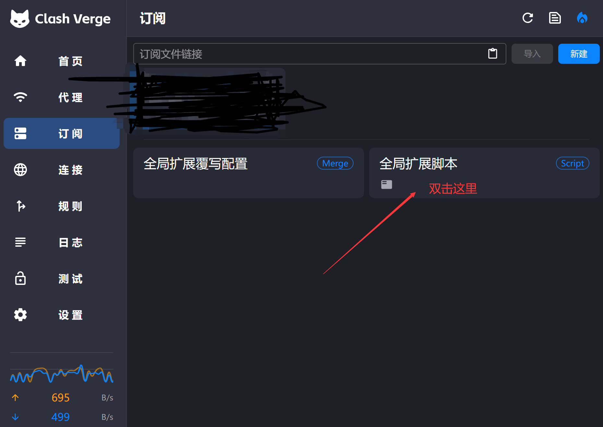
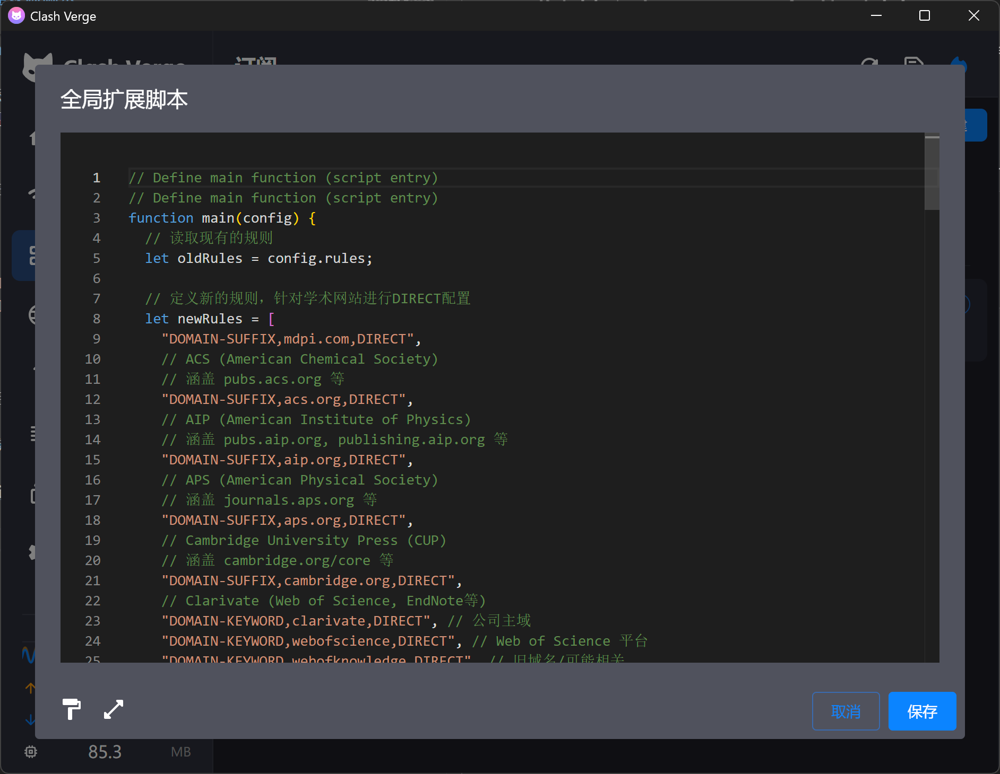
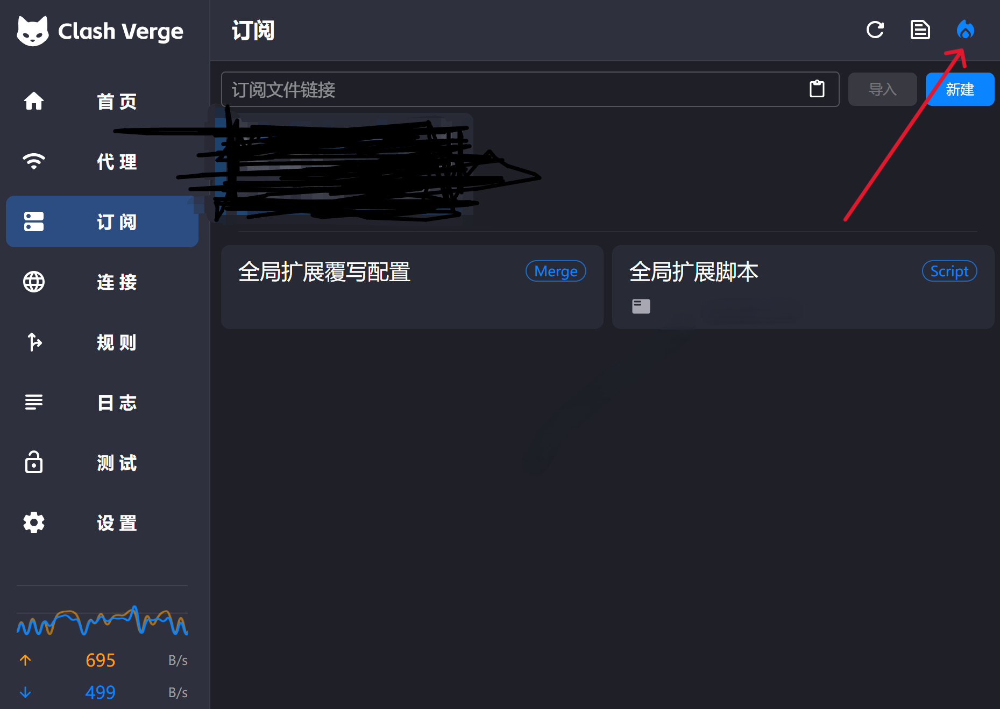

# Clash Verge rev - 学术网站直连规则脚本

## 介绍

该脚本旨在帮助用户在使用Clash Verge时，通过规则配置确保访问学术网站时绕过代理，直接通过学校或本地网络连接。此脚本通过添加自定义规则，使常见的学术期刊网站流量直接访问，避免代理服务器干扰，确保文献下载不受限制。

## 功能

- 向Clash Verge的规则配置中添加一组新的规则。
- 针对常见学术期刊网站（如IEEE、ACM、Springer等）配置 `DIRECT` 规则，确保这些网站通过本地网络连接。
- 简化Clash配置文件的管理，使学术网站的访问更加顺畅。
- 全局脚本，更换订阅机场不影响功能。

## 适用场景

- **学术研究**：如果你是学生或研究人员，通常需要访问学校的IP许可的学术资源。使用此脚本，你可以确保这些学术网站无需代理。
- **网络优化**：通过避免代理，提升学术资源访问速度和稳定性。

## 如何使用

### 1. 下载script.js

### 2. 将脚本加入到Clash Verge rev 全局扩展脚本中
你可以将`script.js`文件中的代码添加到Clash Verge rev的 Rule 模式配置中。通过脚本入口函数，你可以自动更新现有的规则配置。



### 3. 修改并自定义规则（可选）
如果你需要添加其他学术网站，只需在 newRules 数组中添加新的域名规则。例如：

```javascript
let newRules = [
  "DOMAIN-SUFFIX,example.com,DIRECT",
  "DOMAIN-SUFFIX,anotherjournal.com,DIRECT"
];
```
配置解释
DOMAIN-SUFFIX：此规则适用于域名后缀匹配的所有网站。

DIRECT：确保这些网站直接连接，避免通过代理服务器。

no-resolve：防止域名解析影响代理设置。
### 4. 保存并启用配置文件
将修改后的脚本保存一下，然后点击右上角的小火苗图标-->重新订阅，即可启用脚本。





## 参考资料

[1] https://github.com/clash-verge-rev/clash-verge-rev/issues/1437#issuecomment-2395050752

[2] http://u5a.cn/JeNvq
